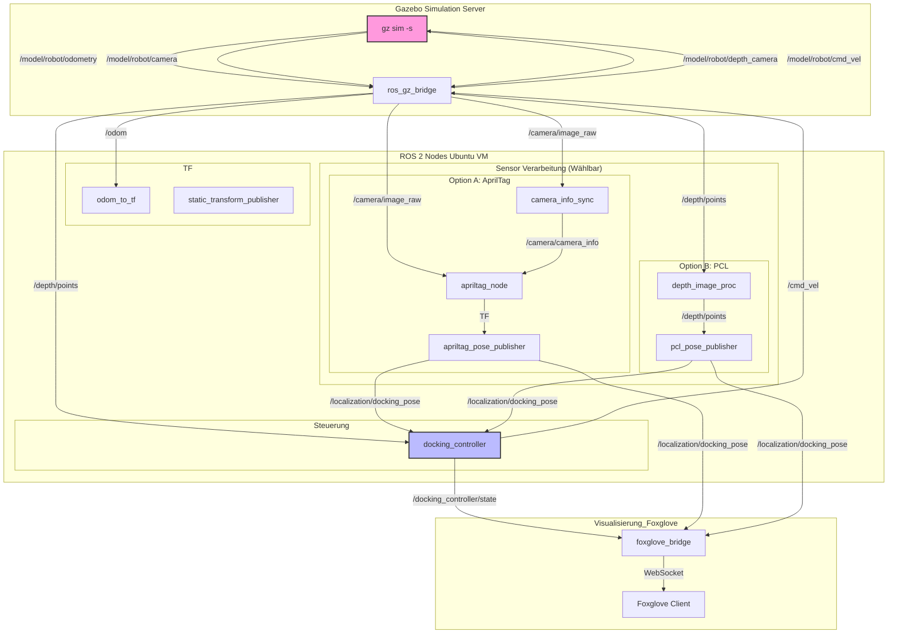

# ROS2_BA_MIRMI: Autonomes Docking-Simulationspaket

Dieses Repository enthält ein ROS 2 Jazzy-Simulationspaket (`mirmi_docking_sim`) zur Demonstration eines autonomen Docking-Manövers eines Roboters an einer Station in Gazebo Harmonic.

Das System unterstützt zwei Lokalisierungs-Methoden:
1.  **AprilTag-basiert:** Erkennung von Fiducial Markers.
2.  **PCL-basiert (Point Cloud Library):** Geometrisches Matching (ICP) auf Tiefendaten.

**Git-Repository:** `https://github.com/dafiiit/ROS2_BA_MIRMI.git`

---

## Systemarchitektur (ROS 2 / Gazebo)

Dieses Diagramm visualisiert den Fluss der Haupt-Topics und die Interaktion der Nodes im System, einschließlich der umschaltbaren Lokalisierungs-Pipeline.



-----

## System-Setup & Voraussetzungen

Dieses Projekt nutzt eine geteilte Simulationsumgebung, bei der der Server (Gazebo) auf einer Ubuntu-VM läuft und der Client (Gazebo GUI) auf dem macOS-Host.

### Host (Mac)

  * **Hardware:** M4 Apple Silicon
  * **Virtualisierung:** UTM
  * **Gazebo:** Gazebo Harmonic (gz 8.9.0)
  * **Visualisierung:** Foxglove App

### VM (Ubuntu in UTM)

  * **Betriebssystem:** Ubuntu 24.04
  * **ROS:** ROS 2 Jazzy
  * **Gazebo:** Gazebo Harmonic (gz 8.9.0)
  * **Netzwerk (UTM):**
      * **Bridged Mode (z.B. Zuhause):** `WiFi (en0)`
      * **Shared Mode (Andere Netzwerke):** IP-Adresse mit `hostname -I` finden (z.B. `192.168.64.7`).

-----

## Installation & Konfiguration

### 1. Repository klonen

Erstellen Sie einen ROS 2 Workspace (z.B. `~/ros2_ws`) und klonen Sie das Repository in den `src`-Ordner:

```bash
mkdir -p ~/ros2_ws/src
cd ~/ros2_ws/src
git clone https://github.com/dafiiit/ROS2_BA_MIRMI.git
```

### 2. Abhängigkeiten installieren

Stellen Sie sicher, dass alle ROS 2-Abhängigkeiten installiert sind:

```bash
# In ~/ros2_ws
rosdep install -i --from-path src --rosdistro jazzy -y

# Manuelle Installation falls rosdep fehlschlägt
sudo apt install ros-jazzy-ros-gz-bridge \
                 ros-jazzy-apriltag-ros \
                 ros-jazzy-foxglove-bridge \
                 ros-jazzy-tf-transformations \
                 ros-jazzy-depth-image-proc
```

### 3. AprilTag-Modelle generieren

Für die Simulation der AprilTags wird das `gazebo_apriltag_harmonic`-Repository benötigt. **Dies muss sowohl auf der Ubuntu-VM als auch auf dem Mac-Host durchgeführt werden.**

```bash
# Klonen (auf beiden Systemen)
cd ~
git clone https://github.com/j-fast/gazebo_apriltag_harmonic.git

# Abhängigkeiten installieren (auf beiden Systemen)
pip3 install jinja2 pillow

# Modelle generieren (auf beiden Systemen)
cd ~/gazebo_apriltag_harmonic
python3 generate_models.py
```

### 4. Umgebungsvariablen (WICHTIG)

Fügen Sie die folgenden Zeilen zu Ihren Shell-Konfigurationsdateien hinzu, um die geteilte Simulation und die AprilTag-Modelle zu aktivieren.

**Auf der Ubuntu-VM (`~/.bashrc`):**
*Hier die IP-Adresse der VM eintragen (ermitteln mit `hostname -I`).*

```bash
export GZ_PARTITION="test_sim"
export GZ_TRANSPORT_IP=192.168.188.85 # <--- IP DER UBUNTU VM EINTRAGEN

# Pfad zu den generierten AprilTag-Modellen
export GZ_SIM_RESOURCE_PATH=$GZ_SIM_RESOURCE_PATH:/home/david/gazebo_apriltag_harmonic/models
```

*Nach dem Speichern: `source ~/.bashrc`*

**Auf dem Mac-Host (`~/.zshrc`):**
*Hier die IP-Adresse der VM eintragen (dieselbe wie oben).*

```bash
export GZ_PARTITION="test_sim"
export GZ_TRANSPORT_SERVER_IP=192.168.188.85 # <--- IP DER UBUNTU VM EINTRAGEN

# Pfad zu den generierten AprilTag-Modellen
export GZ_SIM_RESOURCE_PATH=$GZ_SIM_RESOURCE_PATH:/Users/dein_username/gazebo_apriltag_harmonic/models
```

*Nach dem Speichern: `source ~/.zshrc`*

### 5. Paket bauen

Bauen Sie das `mirmi_docking_sim`-Paket:

```bash
cd ~/ros2_ws
colcon build --packages-select mirmi_docking_sim
```

-----

## Workflow: Simulation starten

Führen Sie die folgenden Schritte in der angegebenen Reihenfolge aus.

**1. Terminal (Ubuntu VM): Gazebo Server starten**
*Startet den "headless" Gazebo-Server. Das `GZ_PARTITION` ist entscheidend.*

```bash
# Ggf. Workspace sourcen
source ~/ros2_ws/install/setup.bash
gz sim -s
```

**2. Terminal (Ubuntu VM): ROS 2 Simulation launchen**
*Startet alle ROS-Nodes. Wählen Sie hier die Lokalisierungsquelle.*

**Option A: AprilTag (Standard)**
```bash
source ~/ros2_ws/install/setup.bash
ros2 launch mirmi_docking_sim simulation.launch.py localization_source:='apriltag'
```

**Option B: PCL (Point Cloud Library)**
```bash
source ~/ros2_ws/install/setup.bash
ros2 launch mirmi_docking_sim simulation.launch.py localization_source:='pcl'
```

**3. Terminal (Ubuntu VM): Foxglove Bridge starten**
*Startet die WebSocket-Brücke für die Visualisierung.*

```bash
source ~/ros2_ws/install/setup.bash
ros2 launch foxglove_bridge foxglove_bridge_launch.xml
```

**4. Terminal (Mac Host): Gazebo Client starten**
*Verbindet sich mit dem laufenden Server auf der VM.*

```bash
gz sim -g
```

**5. Foxglove App (Mac Host)**
*Öffnen Sie die Foxglove-App und stellen Sie eine Verbindung her:*

  * **Verbindungstyp:** `Foxglove WebSocket`
  * **URL:** `ws://192.168.188.85:8765` (Ersetzen Sie die IP durch die Ihrer VM)

-----

## Systemkonfiguration & Schnittstellen

### Paketübersicht

Das Paket `mirmi_docking_sim` stellt die Simulation für einen autonomen Docking-Vorgang bereit.

  * **Launch:** `launch/simulation.launch.py`
      * Argument `localization_source`: Wählt zwischen `'apriltag'` und `'pcl'`.
      * Startet `gz_sim`, `ros_gz_bridge` und die gewählte Pipeline.
  * **ROS-Gazebo-Brücke:** `config/bridge.yaml`
      * Mappt Topics zwischen ROS 2 und Gazebo.
  * **Welt-Modell:** `worlds/docking_world.sdf`
      * Umgebung mit Roboter und Docking-Station.

### Lokalisierungs-Pipelines

Das System nutzt eine modulare Architektur, bei der verschiedene Sensoren eine einheitliche Pose (`/localization/docking_pose`) liefern.

1.  **AprilTag Pipeline:**
    *   `apriltag_node`: Detektiert Tags im RGB-Bild.
    *   `apriltag_pose_publisher`: Transformiert TF-Daten in eine relative Pose zur Hütte.

2.  **PCL Pipeline:**
    *   `depth_image_proc`: Wandelt Tiefenbilder in PointClouds (`/depth/points`).
    *   `pcl_pose_publisher`: Führt ICP (Iterative Closest Point) Matching zwischen der aktuellen PointCloud und einem Referenzmodell der Hütte durch.

### Docking-Logik (`docking_controller.py`)

Der Controller implementiert eine State Machine, die unabhängig von der Lokalisierungsquelle arbeitet. Er nutzt `/localization/docking_pose` für das Ziel und `/depth/points` für eine lokale Hinderniserkennung.

**Zustände:**

1.  **`SEARCHING`**: Roboter dreht sich, bis eine Pose auf `/localization/docking_pose` empfangen wird.
2.  **`LOCALIZING`**: Kurzer Stopp zur Stabilisierung der Lokalisierung.
3.  **`GOTO_RADIUS_POINT`**: Fährt zu einem Einstiegspunkt auf einem Kreisradius (5.5m) um die Hütte.
4.  **`FOLLOW_ARC`**: Fährt auf einer Kreisbahn um die Hütte, bis er vor der Öffnung steht.
5.  **`ALIGN_TO_HUT`**: Richtet sich grob zur Hütte aus.
6.  **`FINAL_ALIGNMENT`**: Präzise Ausrichtung basierend auf der aktuellen Pose.
7.  **`DOCKING`**: Fährt in die Hütte ein, korrigiert dabei kontinuierlich seitlichen Versatz.
8.  **`FINAL_STOP`**: Ziel erreicht (ca. 1.9m vor der Rückwand).

### Parameter

*   `use_ground_truth` (bool): Wenn `True`, wird die exakte Gazebo-Position für Odometrie genutzt (Debug-Modus).
