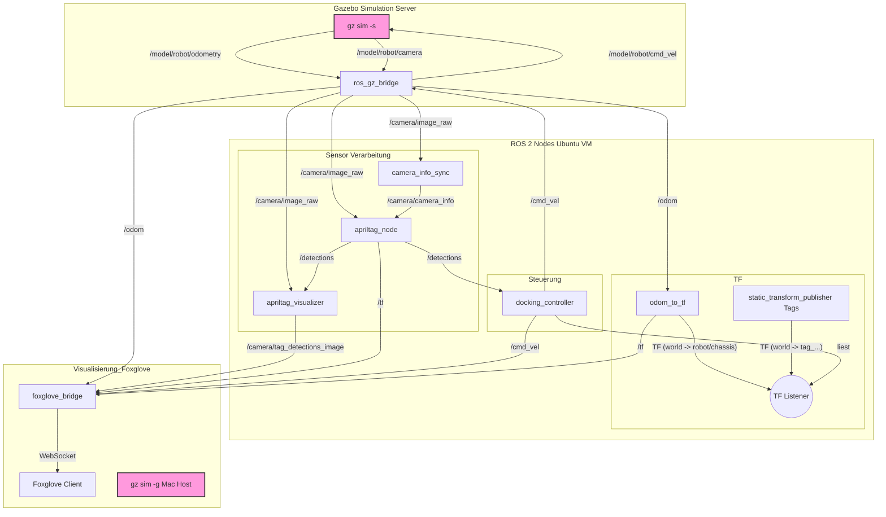

# ROS2_BA_MIRMI: Autonomes Docking-Simulationspaket

Dieses Repository enthält ein ROS 2 Jazzy-Simulationspaket (`mirmi_docking_sim`) zur Demonstration eines autonomen Docking-Manövers eines Roboters an einer Station mit AprilTags in Gazebo Harmonic.

**Git-Repository:** `https://github.com/dafiiit/ROS2_BA_MIRMI.git`

---

## Systemarchitektur (ROS 2 / Gazebo)

Dieses Diagramm visualisiert den Fluss der Haupt-Topics und die Interaktion der Nodes im System.



-----

## System-Setup & Voraussetzungen

Dieses Projekt nutzt eine geteilte Simulationsumgebung, bei der der Server (Gazebo) auf einer Ubuntu-VM läuft und der Client (Gazebo GUI) auf dem macOS-Host.

### Host (Mac)

  * **Hardware:** M4 Apple Silicon
  * **Virtualisierung:** UTM
  * **Gazebo:** Gazebo Harmonic (gz 8.9.0)
  * **Visualisierung:** Foxglove App

### VM (Ubuntu in UTM)

  * **Betriebssystem:** Ubuntu 24.04
  * **ROS:** ROS 2 Jazzy
  * **Gazebo:** Gazebo Harmonic (gz 8.9.0)
  * **Netzwerk (UTM):**
      * **Bridged Mode (z.B. Zuhause):** `WiFi (en0)`
      * **Shared Mode (Andere Netzwerke):** IP-Adresse mit `hostname -I` finden (z.B. `192.168.64.7`).

-----

## Installation & Konfiguration

### 1\. Repository klonen

Erstellen Sie einen ROS 2 Workspace (z.B. `~/ros2_ws`) und klonen Sie das Repository in den `src`-Ordner:

```bash
mkdir -p ~/ros2_ws/src
cd ~/ros2_ws/src
git clone [https://github.com/dafiiit/ROS2_BA_MIRMI.git](https://github.com/dafiiit/ROS2_BA_MIRMI.git)
```

### 2\. Abhängigkeiten installieren

Stellen Sie sicher, dass alle ROS 2-Abhängigkeiten installiert sind:

```bash
# In ~/ros2_ws
rosdep install -i --from-path src --rosdistro jazzy -y

# Manuelle Installation falls rosdep fehlschlägt
sudo apt install ros-jazzy-ros-gz-bridge \
                 ros-jazzy-apriltag-ros \
                 ros-jazzy-foxglove-bridge \
                 ros-jazzy-tf-transformations
```

### 3\. AprilTag-Modelle generieren

Für die Simulation der AprilTags wird das `gazebo_apriltag_harmonic`-Repository benötigt. **Dies muss sowohl auf der Ubuntu-VM als auch auf dem Mac-Host durchgeführt werden.**

```bash
# Klonen (auf beiden Systemen)
cd ~
git clone [https://github.com/j-fast/gazebo_apriltag_harmonic.git](https://github.com/j-fast/gazebo_apriltag_harmonic.git)

# Abhängigkeiten installieren (auf beiden Systemen)
pip3 install jinja2 pillow

# Modelle generieren (auf beiden Systemen)
cd ~/gazebo_apriltag_harmonic
python3 generate_models.py
```

### 4\. Umgebungsvariablen (WICHTIG)

Fügen Sie die folgenden Zeilen zu Ihren Shell-Konfigurationsdateien hinzu, um die geteilte Simulation und die AprilTag-Modelle zu aktivieren.

**Auf der Ubuntu-VM (`~/.bashrc`):**
*Hier die IP-Adresse der VM eintragen (ermitteln mit `hostname -I`).*

```bash
export GZ_PARTITION="test_sim"
export GZ_TRANSPORT_IP=192.168.188.85 # <--- IP DER UBUNTU VM EINTRAGEN

# Pfad zu den generierten AprilTag-Modellen
export GZ_SIM_RESOURCE_PATH=$GZ_SIM_RESOURCE_PATH:/home/david/gazebo_apriltag_harmonic/models
```

*Nach dem Speichern: `source ~/.bashrc`*

**Auf dem Mac-Host (`~/.zshrc`):**
*Hier die IP-Adresse der VM eintragen (dieselbe wie oben).*

```bash
export GZ_PARTITION="test_sim"
export GZ_TRANSPORT_SERVER_IP=192.168.188.85 # <--- IP DER UBUNTU VM EINTRAGEN

# Pfad zu den generierten AprilTag-Modellen
export GZ_SIM_RESOURCE_PATH=$GZ_SIM_RESOURCE_PATH:/Users/dein_username/gazebo_apriltag_harmonic/models
```

*Nach dem Speichern: `source ~/.zshrc`*

### 5\. Paket bauen

Bauen Sie das `mirmi_docking_sim`-Paket:

```bash
cd ~/ros2_ws
colcon build --packages-select mirmi_docking_sim
```

-----

## Workflow: Simulation starten

Führen Sie die folgenden Schritte in der angegebenen Reihenfolge aus.

**1. Terminal (Ubuntu VM): Gazebo Server starten**
*Startet den "headless" Gazebo-Server. Das `GZ_PARTITION` ist entscheidend.*

```bash
# Ggf. Workspace sourcen
source ~/ros2_ws/install/setup.bash
gz sim -s
```

**2. Terminal (Ubuntu VM): ROS 2 Simulation launchen**
*Startet alle ROS-Nodes: Brücke, Controller, AprilTag-Erkennung etc.*

```bash
source ~/ros2_ws/install/setup.bash
ros2 launch mirmi_docking_sim simulation.launch.py
```

**3. Terminal (Ubuntu VM): Foxglove Bridge starten**
*Startet die WebSocket-Brücke für die Visualisierung.*

```bash
source ~/ros2_ws/install/setup.bash
ros2 launch foxglove_bridge foxglove_bridge_launch.xml
```

**4. Terminal (Mac Host): Gazebo Client starten**
*Verbindet sich mit dem laufenden Server auf der VM.*

```bash
gz sim -g
```

**5. Foxglove App (Mac Host)**
*Öffnen Sie die Foxglove-App und stellen Sie eine Verbindung her:*

  * **Verbindungstyp:** `Foxglove WebSocket`
  * **URL:** `ws://192.168.188.85:8765` (Ersetzen Sie die IP durch die Ihrer VM)

-----

## Systemkonfiguration & Schnittstellen

### Paketübersicht

Das Paket `mirmi_docking_sim` stellt die Simulation für einen autonomen Docking-Vorgang bereit.

  * **Launch:** `launch/simulation.launch.py`
      * Setzt die `GZ_SIM_RESOURCE_PATH`-Variable korrekt, um ROS-Modelle und AprilTag-Modelle zu laden.
      * Startet `gz_sim`, die `ros_gz_bridge`, den `apriltag_node` und alle benutzerdefinierten Python-Nodes.
  * **ROS-Gazebo-Brücke:** `config/bridge.yaml`
      * Mappt ROS-Topics (z.B. `/cmd_vel`) auf Gazebo-Topics (z.B. `/model/robot/cmd_vel`).
      * Mappt Gazebo-Sensordaten (z.B. `/model/robot/odometry`, `/model/robot/camera`) auf ROS-Topics (z.B. `/odom`, `/camera/image_raw`).
  * **Welt-Modell:** `worlds/docking_world.sdf`
      * Definiert die Umgebung, inklusive des `ground_plane` und der Lichter.
      * Lädt das Robotermodell (`model://robot`) und die Docking-Hütte (`model://april_hut`) an ihre Posen.
  * **Roboter-Modell:** `models/robot/model.sdf`
      * Definiert das Roboter-Chassis mit Differentialantrieb-Plugin und Rädern.
      * Enthält den Kamera-Sensor (`camera_sensor`) mit 640x480 Auflösung und einem Topic `/model/robot/camera`.
  * **Hütten-Modell:** `models/april_hut/model.sdf`
      * Definiert eine statische Hütte aus Wänden, Boden und Dach.
      * Integriert vier AprilTag-Modelle (ID 1-4) an definierten Positionen.

### Docking-Logik

Der `docking_controller.py` implementiert eine State Machine für den Docking-Vorgang:

1.  **`SEARCHING`**: Roboter dreht sich, bis ein AprilTag erkannt wird.
2.  **`LOCALIZING`**: Roboter stoppt und berechnet seine Welt-Pose basierend auf der TF-Transformation vom erkannten Tag (`tag_frame`) zur Kamera (`camera_sensor`) und zum `world`-Frame.
3.  **`GOTO_WAYPOINT_1`**: Fährt auf einen Zielpunkt im Abstand von 5 Metern zum Hüttenzentrum.
4.  **`GOTO_WAYPOINT_2`**: Fährt zu einem Wegpunkt vor der Öffnung der Hütte.
5.  **`GOTO_WAYPOINT_3`**: Dreht sich zur Hütte und fährt hinein (zum `WAYPOINT_INSIDE`).
6.  **`DOCKING`**: (In dieser Implementierung kombiniert mit Schritt 5)
7.  **`FINAL_STOP`**: Ziel erreicht, Roboter stoppt.

-----

