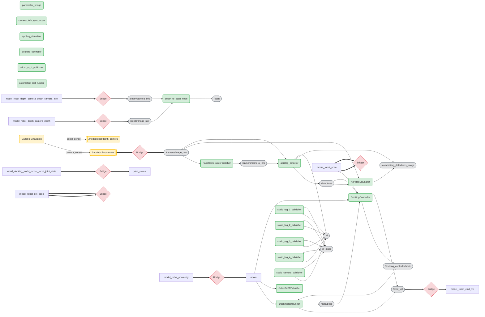

# Smart Interface Dokumentation
> Mit erweitertem Wissen über Standard-Nodes (AprilTag, etc.).

## Erkanntes Verhalten
Das Skript nutzt eine Wissensdatenbank für folgende Launch-Executables:
- `apriltag_node`
- `depthimage_to_laserscan_node`
- `static_transform_publisher`

## System Architektur
