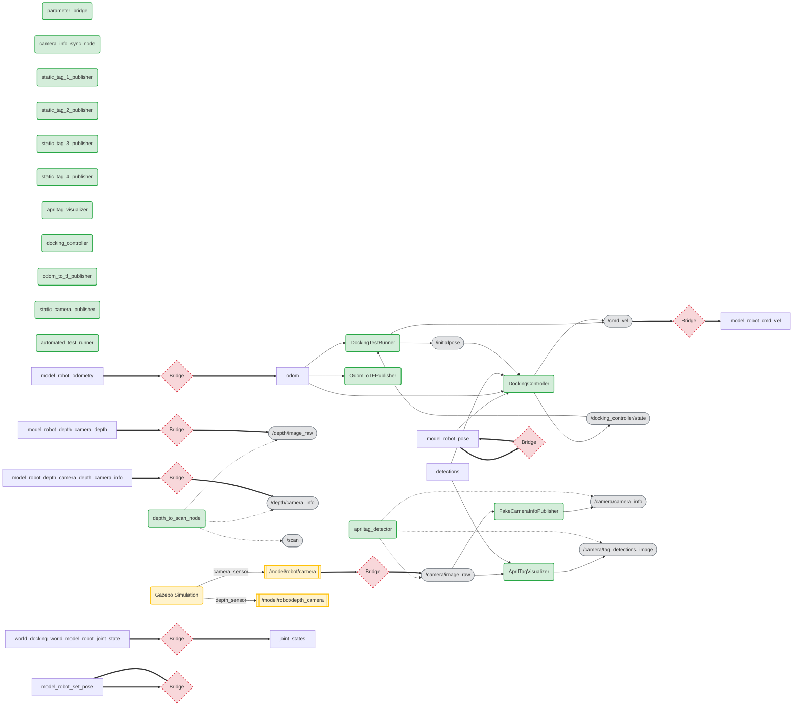

# Interface Dokumentation & Visualisierung
> Automatisch generiert aus Source Code, Launchfiles und Configs.

## Übersicht der Nodes
- **DockingTestRunner** (Python): 2 Subs, 2 Pubs
- **FakeCameraInfoPublisher** (Python): 1 Subs, 1 Pubs
- **OdomToTFPublisher** (Python): 1 Subs, 0 Pubs
- **AprilTagVisualizer** (Python): 2 Subs, 1 Pubs
- **DockingController** (Python): 4 Subs, 2 Pubs
- **parameter_bridge** (Launch): 0 Remappings
- **camera_info_sync_node** (Launch): 0 Remappings
- **apriltag_detector** (Launch): 3 Remappings
- **depth_to_scan_node** (Launch): 3 Remappings
- **static_tag_1_publisher** (Launch): 0 Remappings
- **static_tag_2_publisher** (Launch): 0 Remappings
- **static_tag_3_publisher** (Launch): 0 Remappings
- **static_tag_4_publisher** (Launch): 0 Remappings
- **apriltag_visualizer** (Launch): 0 Remappings
- **docking_controller** (Launch): 0 Remappings
- **odom_to_tf_publisher** (Launch): 0 Remappings
- **static_camera_publisher** (Launch): 0 Remappings
- **automated_test_runner** (Launch): 0 Remappings

## Gazebo Bridge Mapping
| ROS Topic | Gazebo Topic |
|---|---|
| `/cmd_vel` | `/model/robot/cmd_vel` |
| `/odom` | `/model/robot/odometry` |
| `/joint_states` | `/world/docking_world/model/robot/joint_state` |
| `/camera/image_raw` | `/model/robot/camera` |
| `/depth/image_raw` | `/model/robot/depth_camera/depth` |
| `/depth/camera_info` | `/model/robot/depth_camera/depth/camera_info` |
| `/model/robot/pose` | `/model/robot/pose` |
| `/model/robot/set_pose` | `/model/robot/set_pose` |

## System Architektur (Mermaid Visualisierung)
Das folgende Diagramm zeigt den Datenfluss. 
- **Grün**: ROS Nodes
- **Gelb**: Gazebo Simulation
- **Rot**: Bridge
- **Grau**: ROS Topics

